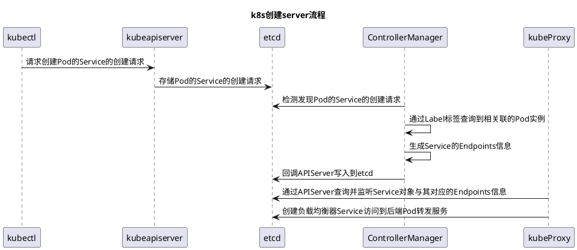

```plantuml
@startuml
title k8s创建server流程


kubectl -> kubeapiserver : 请求创建Pod的Service的创建请求

kubeapiserver -> etcd : 存储Pod的Service的创建请求

ControllerManager -> etcd: 检测发现Pod的Service的创建请求
ControllerManager -> ControllerManager: 通过Label标签查询到相关联的Pod实例
ControllerManager -> ControllerManager : 生成Service的Endpoints信息
ControllerManager -> etcd : 回调APIServer写入到etcd

kubeProxy -> etcd : 通过APIServer查询并监听Service对象与其对应的Endpoints信息
kubeProxy -> etcd : 创建负载均衡器Service访问到后端Pod转发服务

@enduml
```

