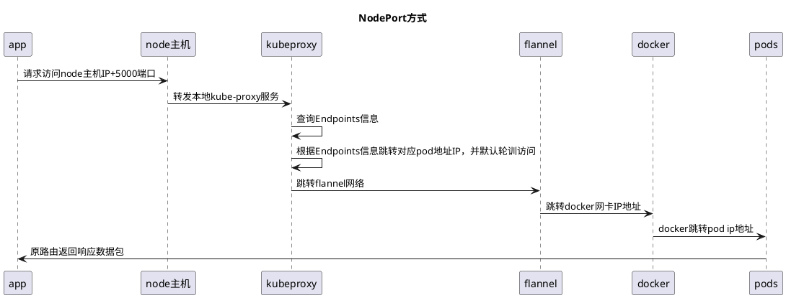

## NodePort是K8s里一个广泛应用的服务暴露方式。
K8s中的service默认情况都是使用Cluster IP这种类型，会产生一个只能在内部访问的Cluster IP，如果想能够直接访问service，需要将service type修改为nodePort。
同时给改service指定一个nodeport值(30000-32767)，用` --service-node-port-range`定义。

>  注意:生产条件app直接访问负载地址，跳转可用的node主机列表,本例只展示k8s流程

