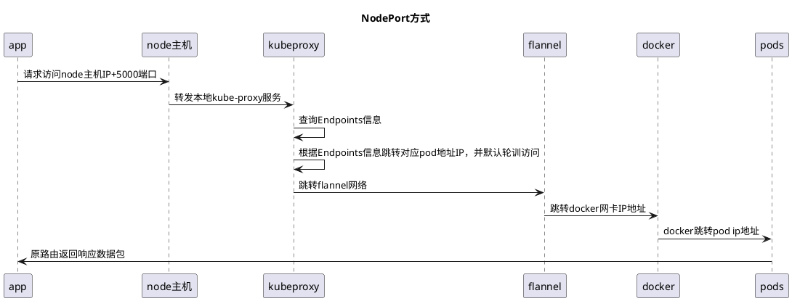
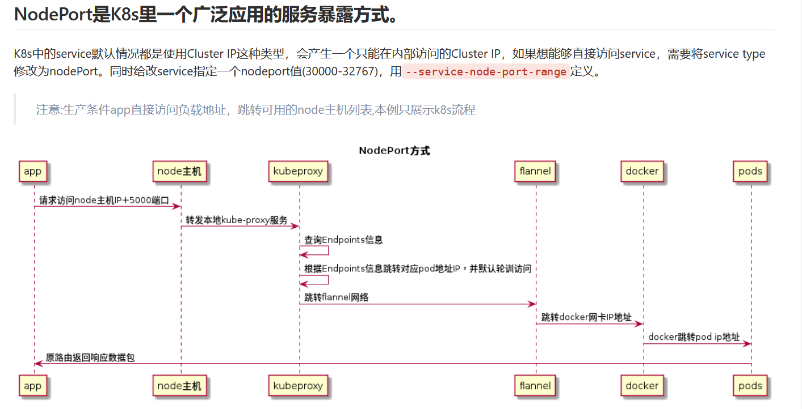

```plantuml
@startuml
title NodePort方式


app -> node主机: 请求访问node主机IP+5000端口

node主机 -> kubeproxy: 转发本地kube-proxy服务

kubeproxy -> kubeproxy: 查询Endpoints信息

kubeproxy -> kubeproxy: 根据Endpoints信息跳转对应pod地址IP，并默认轮训访问

kubeproxy -> flannel: 跳转flannel网络

flannel -> docker: 跳转docker网卡IP地址

docker -> pods: docker跳转pod ip地址


pods -> app: 原路由返回响应数据包

@enduml
```

