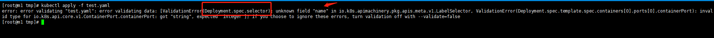
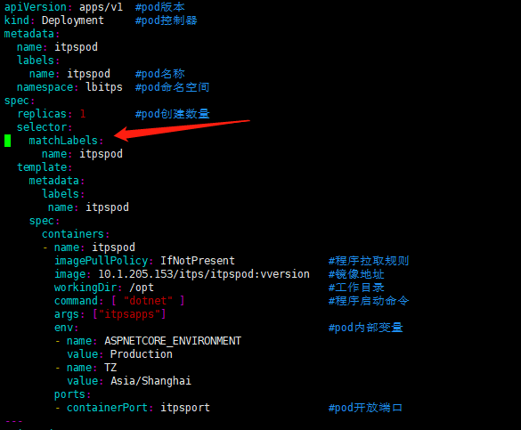

> 生产安装是由kubeadm方式安装，因此集群故障一般较低发生

# 集群故障

```
[root@m1 tmp]# kubectl get node
NAME    STATUS   ROLES    AGE   VERSION
m1      Ready    master   18d   v1.16.9
m2      NotReady    master   18d   v1.16.9
m3      Ready    master   18d   v1.16.9
node1   Ready    <none>   18d   v1.16.9
node2   NotReady    <none>   17d   v1.16.9
node3   Ready    <none>   17d   v1.16.9
```

**1. master节点故障**

检查docker是否启动

> systemctl status docker


> 解决方式: systemctl restart docker || 失败则分析报错信息

检查etcd是否正常
> kubectl get csr

> 解决方式: 找对对应的etcd宿主机，重启etcd（docker start \`docker ps -qa\`） || 如果失败请分析报错日志

检查flannel网络是否正常

> ip add |grep flannel 

> 解决方式: 请查看docker是否正常启动

检查本地haproxy代理是否正常

>  ping \`cat ~/.kube/config | grep server | awk -F "/" '{print $3}' | cut -d : -f 1\`

> 解决方式: 请查看docker容器haproxy是否正常启动

检查时间是否同步
> 查看时间命令 date 

> 解决方法：
> 1. 同步时间 yum install -y ntp && systemctl restart ntpd &&  systemctl enable ntpd 

> 2. 配置时区： timedatectl set-timezone 'Asia/Shanghai'

检查证书是否是否一致
> kubeadm reset

> 解决方式:  重新加入集群


**2. node节点故障**

检查kubelet服务是否正常

> netstat -lnp | grep kubelet

> 解决方法：一般是由于flannel网络故障以及证书不一致导致。

按照master故障检查一遍

**3. 重要组件无法启动**

> 后期添加，还真没遇到过

# pod故障
1. yaml文件格式错误

kubectl apply -f test.yaml
出现报错！
分析：提示(Deployment.spec.selector）在这个层级下的name字段错误



查看后发现当RC控制器换成Deployment后需要在name字段添加层级字段matchLabels:



2. pod创建故障

## 一般创建pod后状态分别为

> Pending 创建pod的请求已经被k8s接受，但是容器并没有启动成功，可能处在：写数据到etcd，调度，pull镜像，启动容器这四个阶段中的任何一个阶段，pending伴随的事件通常会有：ADDED, Modified这两个事件的产生。

> Running pod已经绑定到node节点，并且所有的容器已经启动成功，或者至少有一个容器在运行，或者在重启中。

> Succeeded pod中的所有的容器已经正常的自行退出，并且k8s永远不会自动重启这些容器，一般会是在部署job的时候会出现。

> Failed pod中的所有容器已经终止，并且至少有一个容器已经终止于失败（退出非零退出代码或被系统停止）。

> ERROR 常见于pod内部程序启动失败，查看pod日志分析

> Terminating pod正在等待清除，常见于node节点失联，发出删除任务后无法与node节点连接导致没有收到已删除消息回调。

> Unknown 由于某种原因，无法获得pod的状态，通常是由于与pod的主机通信错误。

> ImagePullBackOff： 正在重试拉取镜像，确认网络以及镜像权限是否正确

3. 正常运行故障


# 异常现象
1. pod拉取镜像失败
2. 一直处于状态
3. pod无法上网