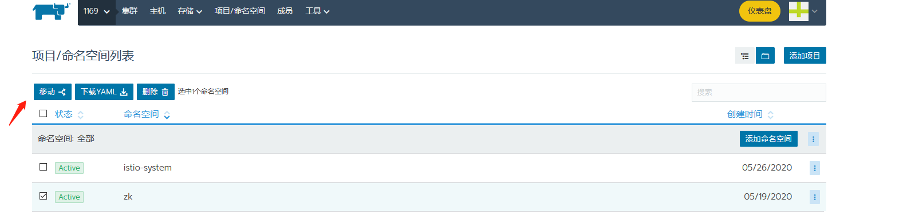
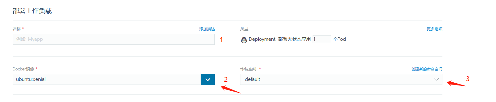
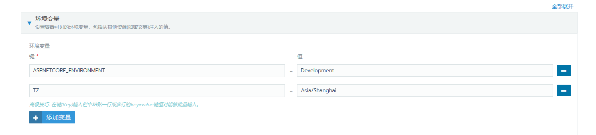
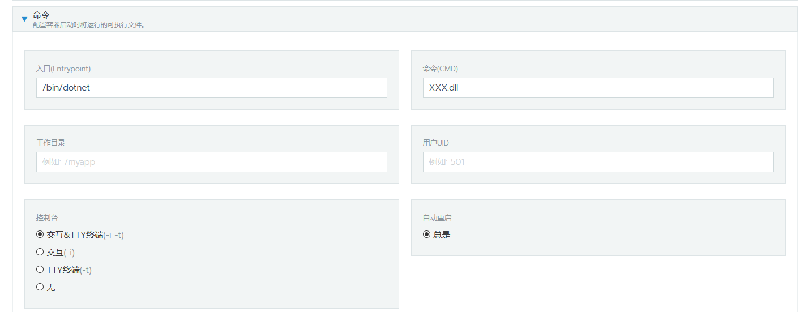
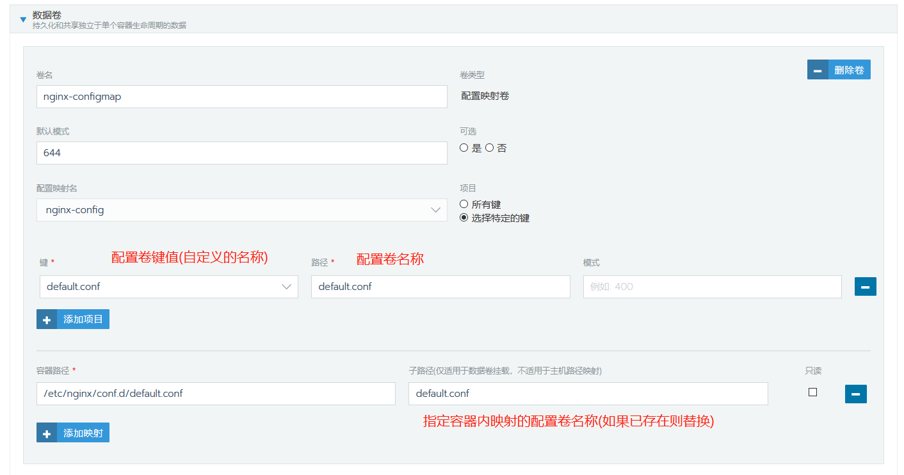
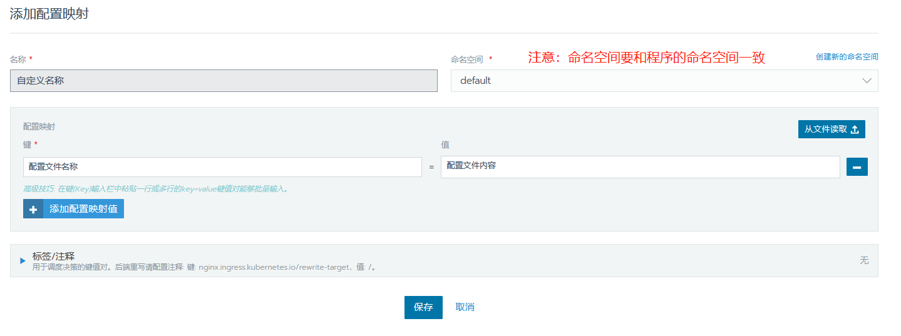
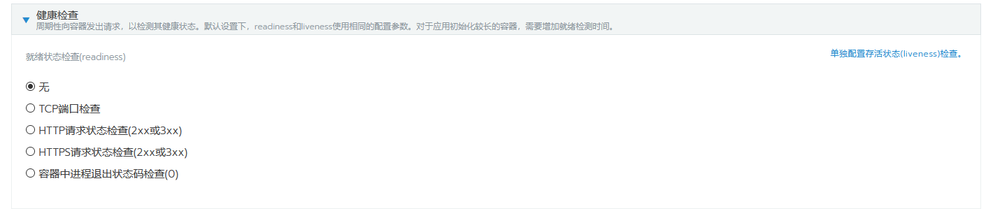

rancher（牧场主）

# 一，创建导入集群

登入rancher点击 添加集群--导入--取名然后确定--选择绕过证书检查命令

> 至此rancher导入集群完毕

## 程序命名空间分类
> 创建rancher的命名空间，项目/命名空间---添加项目---(设置名称)---创建

> 移动到rancher的命名空间

# 二，创建pod详细解说

## 部署方式:
1. master节点利用yaml一建部署创建

> 方便快速的一键式部署程序集群，但是创建后rancher没有权限修改端口。

> kubectl apply -f .

2. 使用rancher创建pod 

> UI人性化的部署pod，拥有pod的所有权限，但是部署速度慢，无法共用yaml文件。

部署服务pod

配置pod基本信息（必填）
> 1，pod名称 

> 2，输入docker镜像地址 

> 3， 选择或者创建命名空间

配置端口（可选）
> 1,输入pod-server名称 2，程序内部端口 3，外部映射端口

配置环境变量（必填）

> TZ代表时区为上海

> ASPNETCORE_ENVIRONMENT 为程序启动环境环境变量 
> Development为测试 
> Production为生产

配置程序启动运行命令（必填）

配置加载映射配置卷（可选）

三，其他

创建程序配置卷

资源--配置映射--添加配置映射

> 作用:在k8s中创建配置模板configmap，当pod启动时，先加载环境配置（环境变量，配置映射，pvc资源等），加载完成后程序读取该配置（如果存在则会被configmap覆盖）进行启动。

pod健康检查

pod健康检查分为3中

1. TCP端口检测

> 进行循环port检测，自定义间隔时间，最低连续失败次数等

2. http/https 请求检测

> 通过GET访问方式，接收返回值来判断程序是否能正常访问。同时自定义间隔时间，最低连续失败次数等。

3. 自定义脚本检测

> 推荐此方式：通过自定义编写检测脚本来对内部进行访问请求。自定义间隔时间，最低连续失败次数等。

